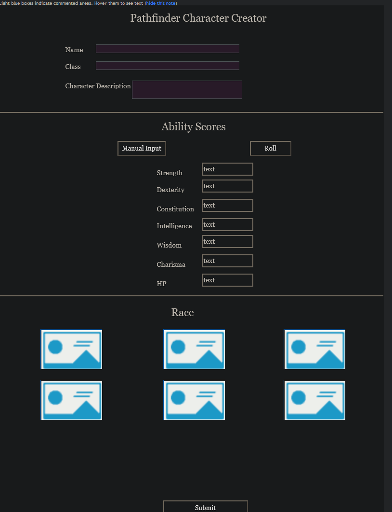

# Term 1 Final Project Proposal

## Pathfinder Character Creator: 
In short, this app will allow its users to create a very simple pathfinder/DnD character.

## Base goals:
Due to the vast amount of objects within a character, I would at the very least like to allow users to input a name, their hp, and ability scores (Str, Dex, Con, Int, Wis, Cha). 
* The player would input their name, class, and character description via textbox
* For hp and ability scores, the users would have a choice between manual input and rolling for them. This choice would be made via two respective buttons.
* In addition, the player would be able to pick from 3-6 races, each of which is represented by pictures.
* Once all options have been filled out, the page will display a character sheet based on the inputs.

## Stretch goals
* Allow users to input skills, as well as the skill ranks of skills based on class
* Allow the input of feats
* Allow the input of Equipment and Gold
* Auto-determine the modifiers 
* Allow for the custom creation of races
* Auto determine and calculate the modifiers
* Speed (Land and Swim if they have a swim skill)

## Basic Goal Layout:

## Unnecessary detailed list of things contained within a character:

Pathfinder characters have a LOT of traits to keep hold of, such as:

* Name
* HP
* Armor Class (AC)
  * Touch Armor Class (TAC)
  * Flat-footed Armor Class (FFAC)
* Speed
* Strength
* Dexterity
* Intelligence
* Wisdom
* Constitution
* Charisma
* Class
* An array of (at most) 36 different skills each with their own values
* Feats
* Equipment

